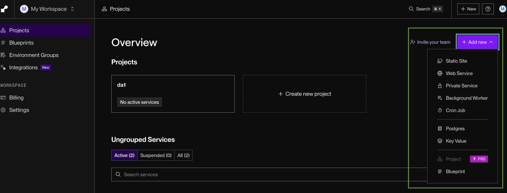
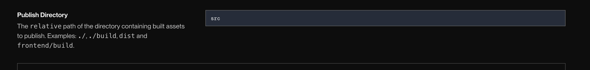
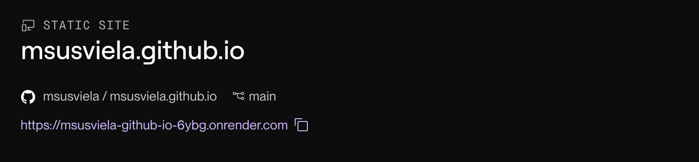

# Guía de despliegue con Render

El despliegue de aplicaciones y sitios web en la nube es una práctica fundamental en el desarrollo de software. En entornos educativos, utilizar GitHub Pages permite a docentes y estudiantes publicar proyectos de manera sencilla, asegurando accesibilidad, mantenibilidad y control de versiones.

El término **deploy** se refiere al proceso de poner en funcionamiento un sistema o aplicación en un entorno donde pueda ser utilizado por los usuarios finales.

Render es un servicio de hosting basado en la nube que permite publicar sitios web estáticos desde un repositorio de GitHub. Esto aprovecha los beneficios de cloud computing, como:

**Accesibilidad Global:** Los sitios están disponibles desde cualquier ubicación con acceso a Internet. Se puede acceder a la aplicación deployada a través de la url, independientemente del entorno de desarrollo.

**Escalabilidad y Fiabilidad:** GitHub maneja la infraestructura sin necesidad de configuraciones adicionales.

**Control de Versiones:** Al estar integrado con Git, permite rastrear cambios y colaborar de manera eficiente.

## Pasos

**Pre-requisito**: Contar con un repositorio público o con un repositorio propio (que no se encuentre dentro de ninguna organización)

**1.**  Acceder a la web de <https://render.com/>

**2.**  Crear una cuenta. Seleccionar la opción gratuita. **No es necesario seleccionar alguna opción de pago.**

**3.**  Una vez creada la cuenta, ir al dashboard: <https://dashboard.render.com/>

**4.**  Seleccionar Add new y la opción de **Static site**

**5.**  Seleccionar Git Provider y seleccionar la cuenta de GitHub en la cual se encuentra el repositorio a deployar (o colocar la url del repositorio público)

**6.**  En las opciones que se despliegan para la configuración, modificar el Publish directory con el directorio dónde se encuentra el código (En este caso en la carpeta src. Si se parte de un repositorio que no utiliza el template de Countries, es necesario poner un directorio donde la lógica del sitio y el index.html sean accesibles). 
Opcionalmente se puede seleccionar la rama en la cuál se encuentra el código a deployar, por defecto se selecciona main.

**7.**  Seleccionar la opción de Deploy Static Site.

**8.**  Una vez seleccionado, se mostrará la url al sitio. Para poder acceder es necesario sumar el path al index.html. En el caso del template de countries:\
    Acceder a la url, sumándole el path interface/index.html al final.\
    En este ejemplo se deberá acceder a
    https://msusviela-github-io-6ybg.onrender.com/interface/index.html

**Documentación de Render para sitios estáticos:**
<https://render.com/docs/static-sites>
